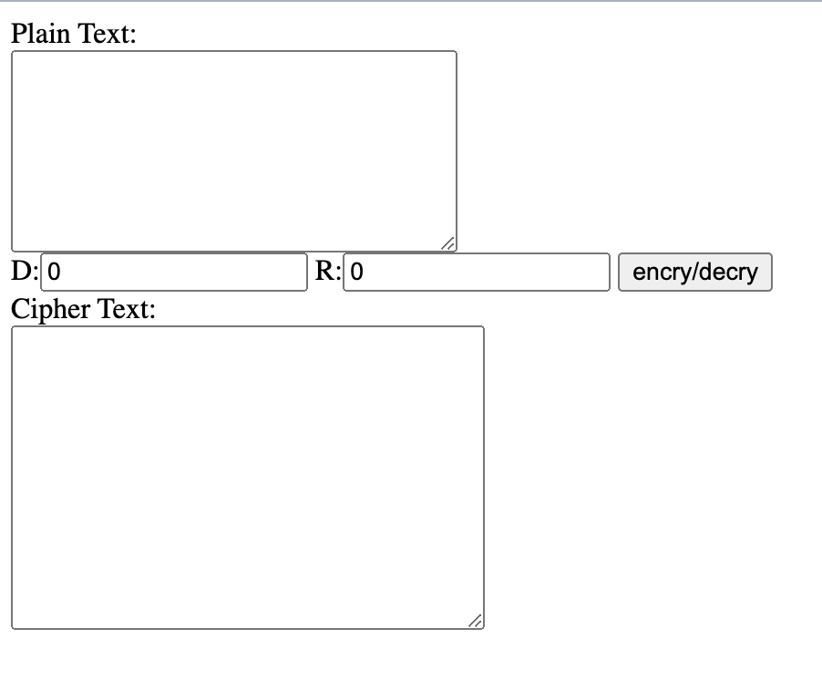

# INCS741 Group Assignment: Implementation of Rail Fence Cipher 
## Step 4 Run a Docker Container
Once the image is built, you can run a Docker container from it using the docker run command(Linux):
```
sudo docker run -p 5000:5000 rf-docker 
```
`sudo` indicates running Docker as the superuser, `docker run` command to create and run a Docker container. `-p 5000:5000` specifies port mapping, this part of command tells Docker to map port 5000 on your host machine to port 5000 in the Docker container. This allowing external access to the Rail Fence Cipher application running inside the container. `rf-docker` is the Docker image that was created before. 

## Step 5 Access to Rail Fence Cipher Application
After the initiation of Docker Container, you can access the Rail Fence Cipher through any web browser(for example, FireFox). The application will run inside the Docker container as per Dockerfile's instruction. 
The application could be access through the link:

[Rail Fence Cipher](127.0.0.1:5000)

```
127.0.0.1:5000
```

Here `127.0.0.1` is the IP address of the Virtual Box which is configured in Ubuntu 20.04. For general access, the IP address need to be changed to your own IP address. You could obtain your own IP address using the Linux command: 
```
ifconfig
```
Here is the application interface looks like: 


### Manual of Using the Rail Fence Cipher Application
#### Note: Before performing encryption or decryption, ensure that all input boxes are cleared.
#### Encryption:
To encrypt a message using the Rail Fence Cipher:

1. Place the plaintext message in the top box.

2. Adjust the key using the Depth (D) and Repetitions (R) values, where:
* D (Depth) determines the number of rails or rows in the cipher.
* R (Repetitions) specifies how many times the algorithm should repeat itself.
3. After setting up the plaintext message and key values (D and R), click the "Encrypt/Decrypt" button.

4. The resulting ciphertext will appear in the bottom box.

#### Decryption:
To decrypt a Rail Fence Cipher message:

1. Enter the ciphertext in the bottom box.

2. Adjust the key using the Depth (D) and Repetitions (R) values, following the same principles as in encryption.

3. Once the ciphertext and key values (D and R) are set, click the "Encrypt/Decrypt" button.

4. The decrypted plaintext will be displayed in the top box.

### Step 6(Optional) Cleanup
If you want to stop the Docker container, you could use `Ctrl + c` to stop.
If you want to remove the Docker image, you could use the `docker rmi` command:
```
sudo docker rmi rf-docker
```
Those commands allows you to manage Docker containers for your application using a Docker file. 
